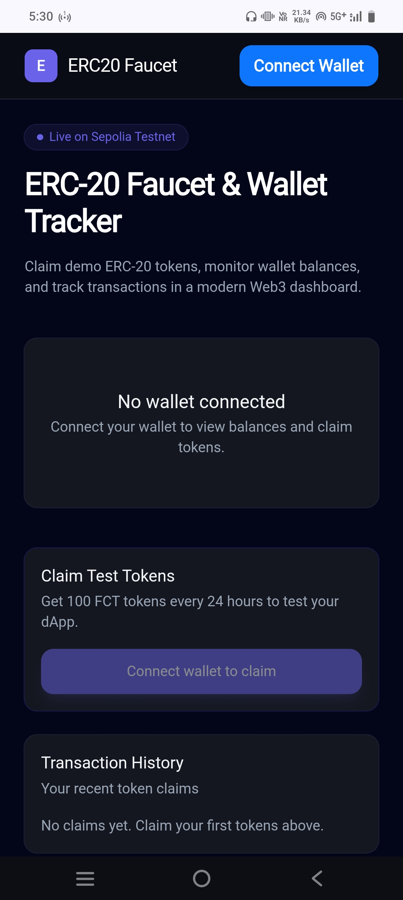
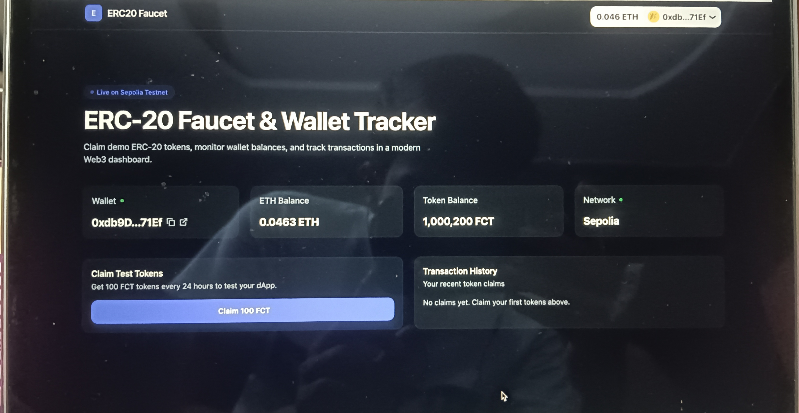
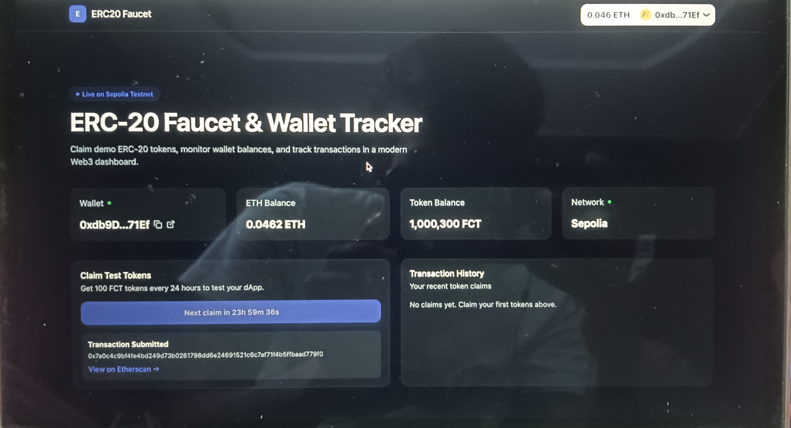

# ERC-20 Faucet & Wallet Tracker 🚰

A modern Web3 dashboard that allows users to connect their wallet, view balances, claim demo ERC-20 tokens, and interact with a smart contract deployed on the Ethereum Sepolia Testnet.

## 🚀 Live Demo

https://erc20-faucet-wallet-tracker.vercel.app

## 📌 Overview

ERC-20 Faucet & Wallet Tracker is a frontend Web3 application built to demonstrate real blockchain interactions.

Users can connect their wallet, check ETH and ERC-20 token balances, switch networks, and claim test tokens from a custom faucet smart contract.

## ✨ Features

- 🔗 Wallet connection using RainbowKit
- ⛓️ Ethereum Sepolia Testnet support
- 💰 Real-time ETH balance tracking
- 🪙 ERC-20 token balance tracking
- 🚰 Claim demo ERC-20 tokens from faucet contract
- ⏳ 24-hour claim cooldown system
- ⚠️ Wrong network detection
- 🎨 Modern responsive Web3 dashboard UI
- ⚡ Fast data fetching with TanStack Query
- 🔐 Smart contract interaction using Wagmi + Viem

## 🛠️ Tech Stack

### Frontend
- React
- TypeScript
- Vite
- Tailwind CSS

### Web3
- Wagmi
- Viem
- RainbowKit
- WalletConnect

### Tools
- Git & GitHub
- Vercel
- Ethereum Sepolia Testnet

## 📸 Screenshots

### Dashboard

### Faucet Transaction

### Mobile Responsive

## 🏗️ Project Architecture

